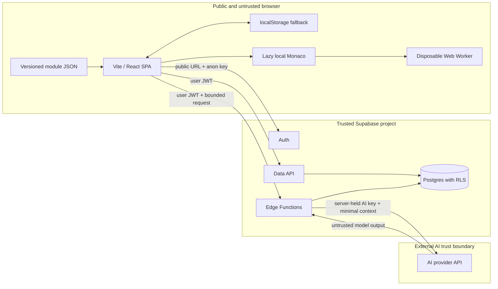

# V2 Architecture

## Baseline and goals

The current product is a Vite 8 single-page application using React 19 and Tailwind 4. Curriculum and UI behavior are coupled in the frontend, progress is stored in `localStorage`, and there is no backend. Monaco is loaded lazily, and JavaScript exercises run in a disposable Web Worker.

V2 keeps the SPA and adds clear seams for serializable curriculum content, authenticated progress, and an optional AI mentor. The core lesson and exercise flow must remain usable without Supabase or AI credentials.

## Target topology

There is intentionally no browser-to-AI-provider path. Versioned module JSON is bundled with the frontend for the MVP; moving content to a managed service is a later decision.

## Frontend boundary

The browser is public and untrusted. Bundled source, network requests, `localStorage`, and every `VITE_*` value can be read or changed by a user.

- Keep only public Supabase URL and anon/publishable key values in browser configuration. A `VITE_*` prefix does not make a secret safe.
- Treat client validation, module locks, XP, and completion UI as user experience controls, not authorization.
- Parse module JSON against a versioned schema before use. Represent exercise checks as declarative data such as `stdout-includes`; do not put React icon references or predicate functions in content.
- Keep local progress as an offline/anonymous fallback. Server data becomes authoritative after an authenticated sync, using an explicit merge policy.
- Render AI output as text or sanitized Markdown. Never inject model output as HTML and never execute model-generated code automatically.
- Limit code, log, and request sizes. Display controlled errors rather than raw provider or backend details.

## Code execution boundary

Monaco is a local dependency loaded only when the editor is opened. Each run creates a fresh Worker, captures bounded console output, enforces a timeout from the main thread, and terminates the Worker after completion or timeout.

The Worker improves reliability and isolates exercise code from the page DOM. It is **not** a security sandbox for hostile code. Worker code can still consume resources and may access browser capabilities such as network APIs unless separately constrained. V2 must not claim that arbitrary third-party code is safe to execute. React multi-file previews are deferred to Sandpack and require a separate threat review.

## Backend boundary

Supabase is the authorization and persistence boundary.

- Enable Row Level Security on every table exposed through the Data API, including new tables before frontend access is added. Expose views only when they honor underlying RLS through `security_invoker`; otherwise keep them out of the exposed schema.
- Default to no access, then add narrow policies based on `auth.uid()` and ownership. Do not rely on filters sent by the SPA.
- Keep service-role credentials, AI keys, webhook secrets, and privileged operations in Edge Functions or another server environment only.
- Validate the JWT, request shape, ownership, size limits, and allowed operation inside each Edge Function.
- Apply per-user rate and budget controls to mentor requests. Log request identifiers, outcome, latency, and usage metadata without storing secrets or unnecessary student content.
- Use migrations and automated policy tests for the planned `profiles`, `user_progress`, and AI usage records before cloud rollout.

## AI boundary

Student messages, code, exercise content, retrieved text, and model output are all untrusted.

- Build the system instruction on the server. Insert user-controlled values only into explicit data delimiters and tell the model not to follow instructions inside them.
- Send only the current objective, the minimum rubric/check metadata, and the student's latest attempt. Avoid personal data and unrelated history.
- Ask for a small structured response, validate it on the server, and reject or replace malformed output.
- Do not send hidden answers when a hint can be generated from objectives and failure categories. Do not ask the model to expose private reasoning.
- Treat prompt defenses as one layer only. Authentication, rate limits, data minimization, output validation, and non-execution are mandatory controls.

## Primary flows

### Anonymous lesson

1. The SPA loads validated, bundled module JSON.
2. Progress is read from and written to versioned `localStorage` keys.
3. Exercise code runs in a disposable Worker; declarative checks evaluate bounded output.

### Authenticated progress

1. Supabase Auth returns a user session to the SPA.
2. The SPA sends the user JWT to the Data API.
3. RLS restricts reads and writes to rows owned by that user.
4. The client applies the documented local/server merge policy and records the sync time.

### Mentor request

1. The SPA sends a bounded request and user JWT to an Edge Function.
2. The function authenticates, validates, rate-limits, and creates the tutor prompt from minimal context.
3. The function calls the AI provider with a server-only key.
4. The function validates the response and returns safe text or structured JSON to the SPA.

## Credential-independent development

Supabase and AI credentials are currently unavailable. Interfaces, module validation, local persistence, Edge Function request/response contracts, prompt templates, and mock adapters can be implemented without them. Cloud authentication, RLS behavior against the hosted project, provider calls, quotas, and deployment remain acceptance gates that cannot be signed off until the corresponding credentials exist.
